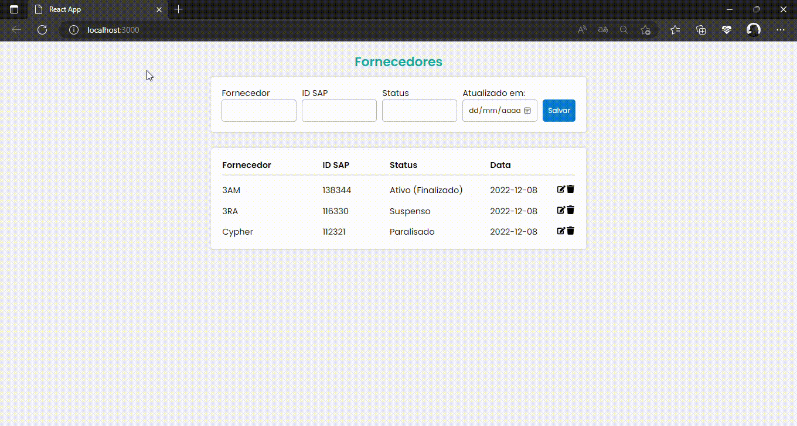

# CadastroFornecedores
CRUD Full Stack de um cadastro de fornecedores, onde o backend é em node, frontend em React.JS e o MySQL como banco.

## Funcionamento

  

## Link
A aplicação está tendo uso interno, sem a possibilidade do compartilhamento de dados sigilosos.

## Desenvolvedoras
- [João Marcelino](https://github.com/marcelinx)
